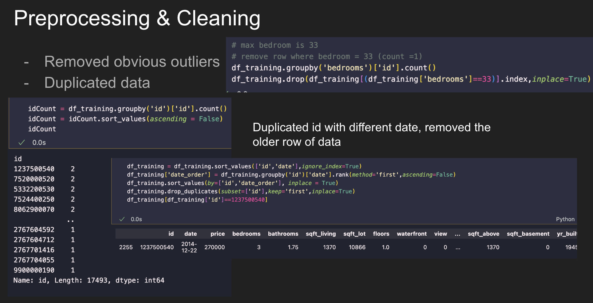
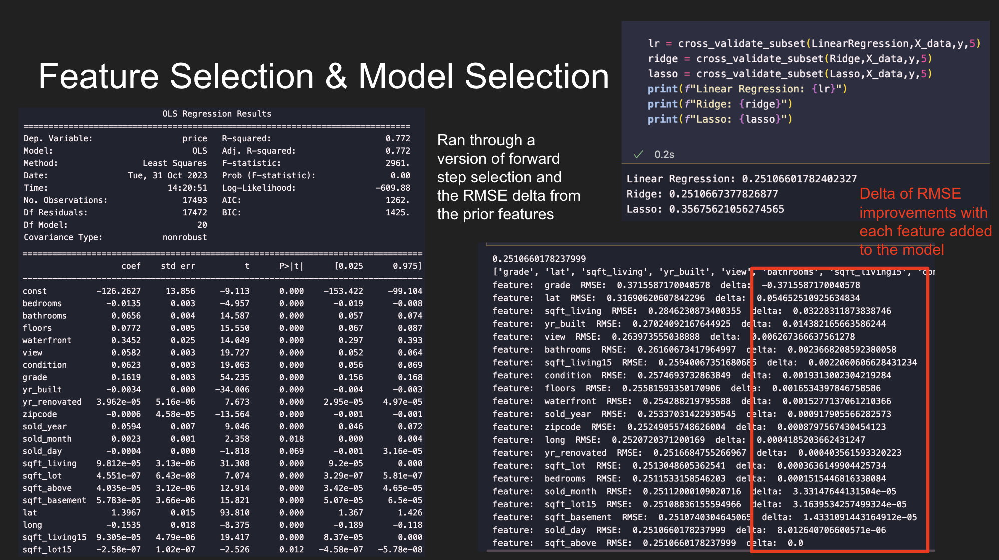
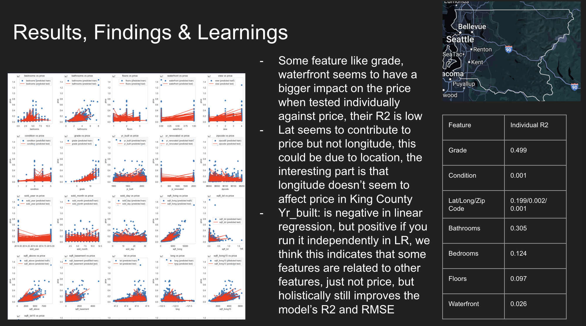

# Linear Regression with Boston Housing data

## Packages 
For our regression models, we utilized statsmodel and scikit-learn packages. 

## Preprocessing and Cleaning 
In the exploratory phase, we discovered there are outliers and duplicates the in the data and removed them. 

  

## Feature Selection & Model Selection 

To identify best feature, we ran a version of forward step selection by seeing which feature contributed to decreasing the RMSE (root mean squared error) and added them to the model. 

For model selection, we ran through 3 models: 
- Linear Regression
- Ridge 
- Lasso 

Base on the RMSE from each model, Linear has the lowest RMSE. For cross validation, we used K-fold, using 5 folds on all models 

  

## Results and Findings 

  

Presentation Link: 
https://docs.google.com/presentation/d/1oMFu_IfJJW_4yeX63r03aYIM-DzvNXZMDPeMJku7MPg/edit?usp=sharing 
